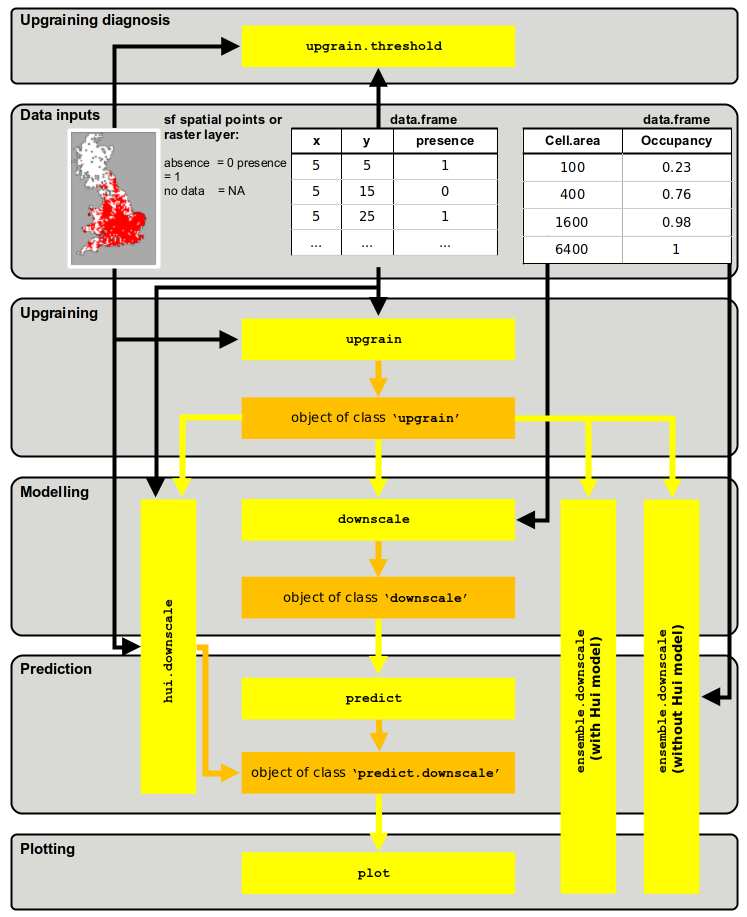

```{r include = FALSE}
knitr::opts_chunk$set(
  collapse = TRUE,
  comment = "#>"
)
```

```{r setup}
library(downscale)
```

# Introduction to downscaling

In order to assess and manage the status of a species we need to know the abundance of individuals in the population(s) and their changes over time. For the vast majority of species this information is unobtainable, however one important proxy of true abundance and extinction risk is the area occupied by the species. For example, the area of occupancy (AOO) is a little-used measure of conservation status in the IUCN red list (IUCN 2014). Although easier to estimate than true abundance, the difficulty in estimating AOO lies in the extensive sampling required across the full range of the species at a grain size sufficiently fine to give meaningful estimates. For the majority of species this is still impractical or unfeasible at these grain sizes leaving a large number of unsampled cells and therefore false absences. However, as we estimate occupancy at increasing grain sizes we increase our confidence in our presence-absence predictions. Such coarse-grain atlas data, generally generated from opportunistic recording over extended periods of time, are much more widely available. However, at such coarse grain sizes we also lose resolution in our status estimates as occupancies at large grain sizes are less closely correlated with true abundance (Hartley and Kunin 2003).

A solution is to employ the occupancy-area relationship (OAR); the increase in the  area occupied by a species as grain size increases (Kunin 1998). If the relationship can be described at these coarser grain sizes where confidence is high, then we can extrapolate to predict occupancy at the fine grain sizes more closely related to the true abundance and conservation status.

Many models have been proposed to describe this geometric relationship, and it appears that no one model consistently provides the best predictions (Azaele et al. 2012, Barwell et al. 2014, Groom et al. 2018, Marsh et al. 2021). This package provides functions for ten commonly applied model: Nachman, power law, logistic, poisson, negative binomial, generalised negative binomial, improved negative binomial, finite negative binomial, Thomas and Hui models. The Hui model (Hui et al. 2006, 2009) is unique in that it only requires data from a single spatial scale but does require the spatial relationships (i.e. cell coordinates) of all cells. The other nine models require the occupancies at multiple grain sizes. The package then attempts to optimise the model parameters to fit the occupancy data in log-log space. Once each model is parameterised the relationships are extrapolated to estimate occupancy at finer grain sizes.

```{r OriginalUpgrain, echo = FALSE, out.width = "100%", fig.align = "left", fig.cap = '"Upraining" of atlas data at a 10km cell width to 20km, 40km and 80 km. As the grain size is increased occupancy also increases.'}

```

As well as the fitting, prediction and plotting of the downscaling models, the package also contains functions for preparing coarse-scale data ("upgraining"; fig. \@ref(fig:OriginalUpgrain)). The tutorial vignette "Upgraining atlas data for downscaling" provides an overview of the different methods for achieving this using the `upgrain.threshold` function.

```{r eval = FALSE}
vignette("Upgraining", package = "downscale")
```

For downscaling it is important to check the data for the scale of saturation and endemism. The scale of saturation is the grain size where all cells are occupied (fig. \@ref(fig:Saturation)a) i.e. the proportion of occupancy = 1. The scale of endemism is the grain size where all presences occur in a single cell (\@ref(fig:Saturation)b). All data above these grain sizes should be discarded as they provide no further information for modelling the occupancy-area curve. The downscale functions will automatically set these occupancies to NA for modelling purposes, but this may lead to insufficient scales (less than three) remaining for modelling.

```{r Saturation, echo = FALSE, out.width = "100%", fig.align = "left", fig.cap = "Occupancy-area relationships (OAR) for two species showing a) the scale of saturation (the grain size at which all cells are occupied) and b) the scale of endemism (the scale at which only one cell is occupied)."}

```

# Using the downscale package

The general flow of the `downscale` package is presented in fig. \@ref(fig:Flow). The package is based around seven user functions:  `upgrain.threshold`, `upgrain`, `downscale`, `predict`, `hui.downscale`, `plot` and `ensemble.downscale`. Ten downscaling models are available (Nachman, power law, logistic, poisson, negative binomial, generalised negative binomial, improved negative binomial, finite negative binomial, Thomas and Hui models). Details of all models can be found in the help files, and in the supplementary information of Barwell et al. 2014. 

The user may input four types of data:

1) A data frame with columns for grain sizes (cell area) and occupancies in that order;
2) A data frame of cell coordinates and presence-absence data (presence = 1; absence = 0). Column names must be "lon", "lat", and "presence" in that order;
3) A spatial points object of class `sf` containing a data frame with presence-absence data (presence = 1; absence = 0) for each coordinate;
4) A raster layer of presence-absence data (presence = 1; absence = 0; no data = NA).

```{r Flow, echo = FALSE, out.width = "70%", fig.align = "left", fig.cap = "Structure of the `downscale` package showing the flow between the seven functions (yellow) and the three output object classes (orange). Black arrows represent the input of raw data of four types: a raster layer or a spatial points layer of presence-absence data, a data frame of cell coordinates and presence-absence for each cell, and a data frame of occupancies at coarse-grain sizes. Yellow arrows are where the output of one function may be used as the input for the next function."}

```

To carry out downscaling with the Hui model (Hui et al. 2006, 2009) or upgraining of atlas data (and exploration of upgraining thresholds) then the input data must be of type 2 or 3. The table below shows the functions to use to achieve desired objectives with regards to input data. In all cases `upgrain.threshold` can be used to explore thresholds for `upgrain`.

|Input data type|Objective|Function flow|
|:--------------|:--------|:------------|
|Data frame of cell areas and occcupancies|Downscale (excluding Hui model)| $\texttt{downscale} \Rightarrow$ <br /> $\texttt{predict} \Rightarrow$ <br /> $\texttt{plot}$|
|Data frame of cell coordinates and presence-absence data|Downscale (excluding Hui model)|$\texttt{upgrain} \Rightarrow$ <br /> $\texttt{downscale} \Rightarrow$ <br /> $\texttt{predict} \Rightarrow$ <br /> $\texttt{plot}$|
|Raster layer of presence-absence data|Downscale (excluding Hui model)|$\texttt{upgrain} \Rightarrow$ <br /> $\texttt{downscale} \Rightarrow$ <br /> $\texttt{predict} \Rightarrow$ <br /> $\texttt{plot}$|
|Data frame of cell coordinates and presence-absence data|Downscale (including Hui model)|($\texttt{upgrain} \Rightarrow$) $\texttt{hui.downscale} \Rightarrow$ <br /> $\texttt{plot}$|
|Raster layer of presence-absence data|Downscale (including Hui model)|($\texttt{upgrain} \Rightarrow$) $\texttt{hui.downscale} \Rightarrow$ <br /> $\texttt{plot}$|
|Data frame of cell areas and occcupancies|Ensemble modelling (excluding Hui model)|$\texttt{ensemble.downscale}$|	
|Data frame of cell coordinates and presence-absence data|Ensemble modelling (with or without Hui model)|$\texttt{upgrain} \Rightarrow$ <br /> $\texttt{ensemble.downscale}$|
|Raster layer of presence-absence data|Ensemble modelling (with or without Hui model)|$\texttt{upgrain} \Rightarrow$ <br /> $\texttt{ensemble.downscale}$|

# Package tutorial

First, we must download the downscale package from CRAN if not already done so.
```{r eval = FALSE}
install.packages("downscale")
```

Then load in the library
```{r eval = FALSE}
library("downscale")
```

We will also make use of the `terra` and `sf` libraries throughout the tutorial for manipulating spatial data
```{r}
library("sf")
library("terra")
```

## A quick example

We will start with the simplest example of using the downscaling package, where we already have occupancy data across a number of grain sizes. We first create some imaginary data; a data frame where the first column are the cell areas (grain size) and the proportion of occupancy as the second column:

```{r}
occupancy <- data.frame(Cell.area = c(100, 400, 1600, 6400),
                        Occupancy = c(0.23, 0.56, 0.87, 1))
```

Now we use downscale to estimate the model parameters for the logistic model to the data. Note: for this type of data input we must also specify the extent (the total area over which occupancy has been measured) which is necessary for converting the modelled proportion of occupancies to area of occupancy (AOO) later on. In this imaginary data we will set extent to be 320000 km$^2$:

```{r}
## fit logistic model to observed data using downscale
logisMod <- downscale(occupancies = occupancy,
                      model       = "Logis",
                      extent      = 384000)
```
                       
This creates an object of class `'downscale'`
```{r}
logisMod
```

The downscale function has estimated best-fit parameters of 0.00201 for `C` and 1.0837 for `z` for the logistic model. We then take these parameters from the `'downscale'` object to extrapolate the fitted logistic function to predict occupancies at finer grain sizes. We will first create a vector of grain sizes (cell area) to predict. If we include the original cell sizes used for modelling we can also observe the model fit.

```{r}
## new grain sizes to predict
areasPred <- c(1, 2, 5, 25, 100, 400, 1600, 6400)

## predict for the new grain sizes using the downscale object
logisPred <- predict(logisMod,
                     new.areas = areasPred,
                     plot = FALSE)
                      
## this creates an object of class 'predict.downscale'
## occupancy is given as a proportion (Occupancy) and area of occupancy (AOO)
logisPred$predicted
```

Now we can plot the predictions with log-log axes. Black points are the observed values, red points are the predicted values.
```{r fig.width = 6, fig.height = 4}
plot(logisPred)
```

## Preparing atlas data for downscaling

For the majority of cases we will have atlas data at a single scale. For downscaling we will need to therefore upgrain the atlas data. Read in the atlas data for a hypothetical UK species provided in the package. In this case the format is a data frame of sample cell coordinates and presence-absence data but it could also be a raster layer:

```{r}
## if it is not already loaded, load in the package
library(downscale)
```

There is some example atlas data included with the package which we can load up for this example. When loading our own data then the data frame must have the column names "lon", "lat" and "presence" (0 = absence; 1 = presence).
```{r}
dataFile <- system.file("extdata", "atlas_data.txt", package = "downscale")
atlasData <- read.table(dataFile, header = TRUE)
head(atlasData)
```

The first step is to upgrain the atlas data to calculate occupancy at larger grain sizes than the atlas data – this provides the occupancy data points to fit the different downscaling models to. If we simply increase the cell sizes of the atlas data then the extent also increases. As downscaling models requires the proportion of occupancy at each grain, if the proportions are calculated from a different total area in each case we may run in to problems. Therefore it is important that we fix the extent of all grain sizes to the extent of the largest grain size, but this means compromising between assigning unsampled cells as absences or excluding sampled cells (Groom et. al. 2018, Marsh et. al. 2018). We therefore carry this out by applying a threshold to the proportion of a coarse-scale cell that has been sampled at the fine-scale. For example, if a 40km width cell was only sampled by a single 10km atlas absence cell within it, we may want to discard it as a) it is likely that at least one of the unsampled cells may actually be a presence (coarse-scale false absence), and b) all the unsampled atlas cells would be assigned as absences even though they have not been sampled (atlas-scale false absence). However, discarding the cell will also lead to some loss of information.

The choice of threshold can have important consequences on the model predictions and so it is highly recommended to read the vignette "Upgraining atlas data for downscaling" and the helpfile for the upgrain.threshold function (`?upgrain.threshold`) for more detail on creating your multi-scale standardised atlas data:

```{r eval = FALSE}
vignette("Upgraining", package = "downscale")
```

The `upgrain.threshold` function allows the user to explore these trade-offs through several plots, and provides four recommendations for possible threshold selections: including all the sampled cells (`"All_Sampled"`); including only cells at the largest grain size that were completely sampled at the atlas scale (`"Sampled_Only"`); a species-specific threshold that retains all species occurrences (`"All_Occurrences"`); and an atlas-specific threshold that maintains the same extent as the original atlas data (`"Gain_Equals_Loss"`).

```{r fig.show = "hide"}
## explore thresholds using upgrain.threshold
thresh <- upgrain.threshold(atlas.data = atlasData,
                            cell.width = 10,
                            scales     = 3)
```

This gives two sets of plots. First is a set of four plots that explore the trade-offs between discarding sampled cells and making assumptions about unsampled cells, which are automatically assigned as absences.

```{r ThresholdPlots, echo = FALSE, out.width = "100%", fig.align = "left"}
knitr::include_graphics("figures/Threshold_plots.png")
```

The second set of plots (hit `return` or click on the plot window to view the second window) are the standardised atlas data generated after applying the four different threshold criteria (`"All_Sampled"`,  `"All_Occurrences"`,  `"Gain_Equals_Loss"` and `"Sampled_Only"`).

```{r ThresholdMaps, echo = FALSE, out.width = "100%", fig.align = "left"}
knitr::include_graphics("figures/Threshold_maps.png")
```

We can see the threshold values for the four threshold criteria
```{r}
thresh$Thresholds
```

Once the user has decided on a threshold value (any value between 0 and 1 can be selected) or one of the threshold criteria, the `upgrain` function will prepare the atlas data for downscaling. For now we’ll use one of the pre-defined options `"All_Occurrences"` which ensures that all occurrence records are retained. This creates an object of class `'upgrain'` which can then then be used directly as an input for `downscale`, along with plots of the original and standardised atlas data at each scale. We will save the `'upgrain'` object here for subsequent analyses in the next section.

```{r fig.height = 5, fig.width = 7}
## upgrain data (using All Occurrences threshold)
occupancy <- upgrain(atlas.data = atlasData,
                     cell.width = 10,
                     scales     = 3,
                     method     = "All_Occurrences",
                     plot       = TRUE)
```

## Downscaling the atlas data - more detailed examples

As we can pass our `'upgrain'` object directly in to the `downscale` function we no longer require to specify the extent. Let’s try the improved negative binomial model (INB) first:

```{r}
## Improved Negative Binomial model
(inb <- downscale(occupancies = occupancy,
                  model = "INB"))
```

The downscaling functions use an optimisation procedure to fit the models to the upgrained occupancy data. Suitable starting values for model parameters are automatically inputted, however if the models aren’t converging then it is possible to specify user-specific parameters. The table below shows the default starting parameters implemented.

|Model|Full name|Parameter 1|Parameter 2|Parameter 3|
|:----|:--------|:----------|:----------|:----------|
|`Nachman`|Nachman|`"C"` = 0.01|`"z"` = 0.01||
|`PL`|Power law|`"C"` = 0.01|`"z"` = 0.01||
|`Logis`|Logistic|`"C"` = 0.01|`"z"` = 0.01||
|`Poisson`|Poisson|`"lambda"` = 1e-8||
|`NB`|Negative binomial|`"C"` = 0.01|`"k"` = 0.01||
|`GNB`|Generalised negative binomial|`"C"` = 0.00001|`"z"` = 1|`"k"` = 0.01|
|`INB`|Improved negative binomial|`"C"` = 1|`"r"` = 0.01|`"b"` = 0.1|
|`FNB`|Finite negative binomial|`"W"` = 10|`"k"` = 10||
|`Thomas`|Thomas|`"rho"` = 1e-8|`"mu"` = 10|`"sigma"` = 1|

If using your own parameters, they must be in the form of a list with the same parameter names (take particular note of capitals) as the original starting parameters:

```{r}
### Manually specifying the starting parameters
paramsNew <- list("C" = 0.1, "gamma" = 0.00001, "b" = 0.1)
inbNew <- downscale(occupancies = occupancy,
                     model = "INB",
                     starting_params = paramsNew)
```

We can visually compare the two to see which has a better fit by extrapolating the modelled curves to finer grain sizes using `predict` as before (plotting can be called directly from `predict` or through `plot`). The first plot is the prediction using the original parameters and the second plot using the new parameters (a much worse fit in this case):

```{r fig.width = 5, fig.height = 4}
## plot the predictions of two FNB models using predict.downscale
inbPred <- predict(inb,
                   new.areas = c(1, 2, 5, 25, 100, 400, 1600, 6400),
                   plot = TRUE)
inbPredNew <- predict(inbNew,
                      new.areas = c(1, 2, 5, 25, 100, 400, 1600, 6400),
                      plot = TRUE)
```

The Thomas model (Azaele et al. 2012) involves an integration process that can be time-consuming to run. For this reason the user may alter the tolerance during integration – the finer the tolerance the more accurate the prediction but the longer the computation time. It can therefore be a good idea to initially try a larger tolerance value than the default ($1e^{-6}$) in order to ascertain if the starting parameters are likely to be correct. You can then always use the parameter estimates as the starting parameters when using a smaller tolerance value.

```{r fig.width = 5, fig.height = 4}
## Thomas model
thomas <- downscale(occupancies = occupancy,
                    model       = "Thomas",
                    tolerance   = 1e-3)
                    
## the tolerance can also be set for the predict function
thomas.pred <- predict(thomas,
                       new.areas = c(1, 2, 5, 25, 100, 400, 1600, 6400),
                       tolerance = 1e-6)
```

When plotting the results we can also change the look of the graphics. For example:
```{r fig.width = 5, fig.height = 4}
plot(thomas.pred,
     col.pred = "green",  # change the colour of the prediction
     pch      = 16,       # change point character
     lwd.obs  = 3)        # change line width of the observed data
```

The Hui model is slightly different from the other downscaling models in that it does not need occupancy from multiple scales (Hui et al. 2006, 2009). Instead, it only takes the coordinates of presence-absence data at the atlas scale and uses this to calculate occupancy at finer grain sizes. For this reason it is implemented using a separate function, `hui.downscale`, which in effect runs `downscale` and `predict.downscale` in a single step. 

The input data must either be a presence-absence raster layer of the atlas data, or a data frame of cell coordinates and presence-absence data. Additionally the function requires the cell widths of the input data, and if using a data frame as the input data, the total extent, and the grain sizes (cell area) for which we wish to predict occupancy. These must be smaller than the cell area of the input data. Like the Thomas model, the tolerance can be specified if the results appear inaccurate (set tolerance to a smaller number) or takes extensive programming time (set tolerance to a larger number).

```{r fig.width = 5, fig.height = 4}
## Hui model using a data frame as input
hui <- hui.downscale(atlas.data = atlasData,
                     cell.width = 10,
                     extent     = 228900,
                     new.areas  = c(1, 2, 5, 15, 50))

## the output is a normal 'predict.downscale' object	
plot(hui)
```

Or we can use the 'upgrain' object as input which will use the extent-standardised data.
```{r fig.width = 5, fig.height = 4}
huiStand <- hui.downscale(atlas.data = occupancy,
                          cell.width = 10,
                          new.areas  = c(1, 2, 5, 15, 50),
                          plot       = TRUE)
```

It is critical to note here that the proportion of occupancies are very different between the two plots (note the differences in y-axis values). This is because the extents are different between the original atlas data (228,900 km$^2$) and the standardised atlas data (`r format(occupancy$extent.stand, scientific = FALSE)` km$^2$).

For example, here are the predicted proportion of occupancies (column 'Occupancy') and area of occupancies (column 'AOO' in km$^2$) for the original data:
```{r}
hui$predicted
```

And the extent-standardised data:
```{r}
huiStand$predicted
```

If comparing predictions using multiple models it is therefore crucial to use the same standardised data in all cases, or else only compare the converted area of occupancies (AOO) and not the proportion of occupancies, although even the AOO values will differ slightly depending on the upgraining method.

## Ensemble modelling

No single model appears to provide the most accurate fine-scale occupancy predictions in all cases (Azaele et al. 2012; Barwell et al. 2014; Groom et al. 2018), and it is difficult to predict which model will in a given situation. The ensemble function will model and predict occupancy for multiple models simultaneously, and also applies a simple model averaged prediction (the means of the log occupancies). Some or all of the models can be selected. 

Again, lets start where our data is a data frame of occupancies at each grain size:
```{r}
## hypothetical occupancy data
occupancy <- data.frame(Cell.area = c(100, 400, 1600, 6400),
                        Occupancy = c(0.23, 0.56, 0.87, 1))
                        
## grain sizes (cell areas) to predict
areasPred <- c(1, 2, 5, 25, 100, 400, 1600, 6400)
```

The `ensemble.downscale` function does the modelling and predicting in a single step so we need a few more arguments than when just using `downscale`. We also need the cell areas of the fine grain sizes we wish to predict, the total extent and the models we wish to apply. Also note, with this type of input data we can not apply the Hui model.

When plotting the results The model averaged predictions are in grey and the model predictions in red.
```{r fig.width = 7, fig.height = 6}
ensemble <- ensemble.downscale(occupancies = occupancy,
                               new.areas   = areasPred,
                               extent      = 320000,
                               models      = c("PL",
                                               "Logis",
                                               "NB",
                                               "GNB",
                                               "INB"),
                               plot        = TRUE)
```

To print the predicted proportion of occupancies for each model:
```{r}
ensemble$Occupancy
```

And to print the predicted area of occupancies (AOO) for each model
```{r}
ensemble$AOO
```

Alternatively, the input data may be an object of class `'upgrain'`, which also allows us to run the Hui model as long as we specify the cell width:
```{r fig.width = 7.5, fig.height = 6}
dataFile <- system.file("extdata", "atlas_data.txt", package = "downscale")
atlasData <- read.table(dataFile, header = TRUE)

## upgrain data (using "All Occurrences" threshold)
occupancy <- upgrain(atlas.data = atlasData,
                     cell.width = 10,
                     scales     = 3,
                     method     = "All_Occurrences",
                     plot       = FALSE)

## ensemble modelling
ensemble <- ensemble.downscale(occupancies = occupancy,
                               new.areas   = areasPred,
                               cell.width  = 10,
                               models      = c("Nachman",
                                               "PL",
                                               "Logis",
                                               "GNB",
                                               "FNB",
                                               "Hui"),
                               plot         = TRUE)
```

If we want to run all ten models we can specify `models = "all"`. Once again, we can set the tolerance values for the modelling (`tolerance_mod`) and prediction (`tolerance_pred`) of the Thomas model and the Hui model (`tolerance_hui`) to improve processing times or accuracy.

```{r fig.width = 7.5, fig.height = 6}
ensemble <- ensemble.downscale(occupancies   = occupancy,
                               new.areas     = areasPred,
                               cell.width    = 10,
                               models        = "all",
                               tolerance_mod = 1e-3,
                               plot          = TRUE)
```

We can also specify the starting parameters for specific models. For each model the starting parameters should be in the form of a list as before, and each model list is an item in a combined list:
```{r fig.width = 7.5, fig.height = 6}
## Specifying starting parameters for Nachman and GNB models
newParams <- list(Nachman = list("C" = 0.1, "z" = 0.01),
                  GNB = list("C" = 0.1, "z" = 1, "k" = 0.01))
newParams

ensemble <- ensemble.downscale(occupancies     = occupancy,
                               new.areas       = areasPred,
                               cell.width      = 10,
                               models          = "all",
                               tolerance_mod   = 1e-3,
                               starting_params = newParams,
                               plot            = TRUE)
```

## Creating atlas data from point records

It may be that instead of having pre-existing atlas data, we may need to create our own coarse-scale data from point records (for example herbarium records or GBIF data).

The grain size (cell width) needs to be carefully chosen so that we can best meet the assumption that all cells have been sampled. The larger the grain size the greater our confidence in each cell's status, but the further we will have to downscale and the fewer coarse-grain data points we will have for model fitting. If there are cells or regions where we do not expect this to be the case it may be best to change these to NAs rather than assign them as absences.

The library `rgbif` will automatically harvest GBIF data for a desired species for a specified region. If you do not already have it, then you can install the package through `install.packages("rgbif")`. We will use the `sf` package for handling the spatial points.
```{r}
## load in the necessary libraries
library(rgbif)
```

We’ll get the UK records for the chalkhill blue (*Polyommatus coridon*), a butterfly species with a patchy breeding distribution largely in the south of the UK. We will confine ourselves to records only from the UK (`gbifopts = list(country = "GB")`). For this tutorial I have saved this dataset within the package, but you can repeat the download yourself with the following code. See `?occ_search` to explore the options of how to select different types and certainty of occurrence points.
```{r eval = FALSE}
### NOT RUN in this tutorial
### Run this code to download the data yourself (results will slightly differ)
records <- occ_search(scientificName = "Polyommatus coridon",
                      country        = "GB",
                      limit          = 10000,
                      hasCoordinate  = TRUE,
                      fields         = "minimal")
records <- records$data
```

In this tutorial we will instead load a copy of the data already available in this package.
```{r}
recordsFile <- system.file("extdata", "Polyommatus_coridon_gbif_records.txt",
                           package = "downscale")
records <- read.table(recordsFile, header = TRUE)
```

Whichever way you have got the data (either downloading your own set or loading in the data frame stored in the package), for our purposes we only need to extract the coordinates of the occurrences.
```{r}
recordsCoords <- st_as_sf(records,
                          coords = c("decimalLongitude", "decimalLatitude"),
                          crs = "OGC:CRS84")
```

The coordinates are in latitude/longitude based upon the WGS84 coordinate system. However, a lot of the point records for UK butterflies are collected based upon the British National Grid ("OSGB 1936"), which can be seen in the grid-like pattern of some of the points so it makes sense to reproject the points to this coordinate system (the EPSG code is 27700 and details can be found at https://epsg.io/27700 ). As an added advantage we can also specify the units as km to make our upgraining easier.
```{r}
## reproject the coordinates to British National Grid
BNG <- "+proj=tmerc +lat_0=49 +lon_0=-2 +k=0.9996012717 +x_0=400000 +y_0=-100000 +ellps=airy +units=km +no_defs"
recordsCoords <- st_transform(recordsCoords,
                              crs = BNG)
```

We can have a quick look at the point records if we like.
```{r fig.width = 6, fig.height = 5}
plot(st_geometry(recordsCoords), axes = TRUE)
```

Now we have to convert these points in to a coarse-scale raster. The simplest method is to bound our raster by the limits of the location coordinates. Careful thought must also be put in to the grain size. It must be large enough that we are confident it is an accurate representation of presence-absence, but also small enough to allow upgraining to give at least three spatial scales worth of occupancy data for fitting the downscaling models. In the UK, butterflies are generally sampled at a 10 km grid cell, so we'll set a grain size of 20 km width (400 km$^2$), which gives us a little more certainty in our atlas data but will still comfortably allow us to upgrain to give three scales (400, 1600, 6400 km$^2$).
```{r fig.width = 5, fig.height = 4}
## set grain size as 20 km
cellWidth <- 20

# extract extent of coordinates
coordsExtent <- ext(recordsCoords)

## create a blank raster to fit the coordinates (note the addition of half a 
## cell width on all sides)
gbif_raster <- rast(xmin = coordsExtent$xmin - (cellWidth / 2),
                    xmax = coordsExtent$xmax + (cellWidth / 2),
                    ymin = coordsExtent$ymin - (cellWidth / 2),
                    ymax = coordsExtent$ymax + (cellWidth / 2),
                    res = cellWidth)
                      
## assign cells with presence records as 1
gbif_raster <- rasterize(recordsCoords, gbif_raster, field = 1, fun = "min")

## convert cells with NA (no records) to 0
gbif_raster[is.na(gbif_raster)] <- 0

plot(gbif_raster, legend = FALSE)
```

As our area is rectangular we should not be too worried about setting our thresholds for upgraining, and so we can choose the `"All_Sampled"` option to maintain all data.
```{r fig.height = 5, fig.width = 7}
occupancy <- upgrain(atlas.data = gbif_raster,
                     scales     = 2,
                     method     = "All_Sampled")
```

We can see there has not been much increase in extent after upgraining:
```{r}
## The extent of the original atlas data
occupancy$occupancy.orig[1, 2]

## The extent of the standardised atlas data
occupancy$extent.stand
```

Now we can run our ensemble downscaling models:
```{r fig.height = 6, fig.width = 7.5}
ensemble <- ensemble.downscale(occupancies   = occupancy,
                               models        = c("all"),
                               new.areas     = c(1, 10, 100, 400, 1600, 6400),
                               tolerance_mod = 1e-3)
```

The INB model has predicted a 0 at the finest grain size which we know to be impossible and so has thrown up a warning. As a result, we have not averaged across models at this finest grain (the grey line). This highlights the importance of visually inspecting the model fits. We can try tweaking it’s starting parameters to see if we can get a better fit using the `starting_params` argument:
```{r fig.height = 6, fig.width = 7.5}
ensemble <- ensemble.downscale(occupancy,
                               models = "all",
                               new.areas = c(1, 10, 100, 400, 1600, 6400),
                               tolerance_mod = 1e-3,
                               starting_params = list(INB = list(C = 10, 
                                                                 gamma = 0.01, 
                                                                 b = 0.1)))
```

And the predicted mean area of occupancies for each grain size:
```{r}
ensemble$AOO[, c("Cell.area", "Means")]
```

So far we have simply drawn a rectangle around our points, but perhaps we have a better idea of the possible range limits of the species. In our case, it is probably sensible to set the extent as mainland UK. A shapefile of the UK has been provided which we can load in.
```{r fig.height = 4, fig.width = 5}
### read in the shapefile
uk <- system.file("extdata", "UK.shp", package = "downscale")
uk <- st_read(uk)

## plot our GBIF records on top of the UK polygon
plot(st_geometry(uk), axes = TRUE)
plot(recordsCoords[1], add = TRUE, col = "red")
```

Now, we make our raster of presence-absence the same way as before, except this time we set the extent to be the same as that of the polygon. We then mask the raster file with the UK polygon so that any cells outside this polygon are assigned as NA (unsampled cells):
```{r fig.height = 5, fig.width = 4}
## create a blank raster with the same extent as the UK polygon
gbif_raster <- rast(ext = ext(uk),
                    res = cellWidth,
                    crs = crs(uk))

## assign cells with presence records as 1
gbif_raster <- rasterize(recordsCoords, gbif_raster, field = 1)

## convert cells with NA (no records) to 0
gbif_raster[is.na(gbif_raster)] <- 0

## mask the raster to the UK polygon, so cells outside the polygon are NA
gbif_raster <- mask(gbif_raster, uk)

## plot the masked atlas raster and overlay with the UK polygon
plot(gbif_raster, legend = FALSE)
plot(st_geometry(uk), add = TRUE)
```

Now, we just upgrain and downscale as before:
```{r fig.height = 5, fig.width = 7}
occupancy <- upgrain(gbif_raster,
                     scales = 2,
                     method = "All_Sampled")
```

```{r fig.height = 6, fig.width = 7.5}
ensembleUK <- ensemble.downscale(occupancy,
                                 models = "all",
                                 new.areas = c(1, 10, 100, 400, 1600, 6400),
                                 tolerance_mod = 1e-3,
                                 starting_params = list(INB = list(C = 10,
                                                                   gamma = 0.01,
                                                                   b = 0.1),
                                                        Thomas = list(rho = 1e-6,
                                                                      mu = 1,
                                                                      sigma = 1)))
```

And the predicted mean area of occupancies for each grain size
```{r}
ensembleUK$AOO[, c("Cell.area", "Means")]
```

If we want to compare predicted occupancy between the two methods we must compare the converted area of occupancies (AOO), not the proportion of occupancies as these are calculated from different extents. In this case the estimates for grain sizes of 1 km and 10 km from the bounded rectangle (AOO = `r round(ensemble$AOO$Means[1], 0)` km$^2$ and `r round(ensemble$AOO$Means[2], 0)` km$^2$) are a little different from the estimates using the full mainland UK (AOO = `r round(ensembleUK$AOO$Means[1], 0)` km$^2$ and `r round(ensembleUK$AOO$Means[2], 0)` km$^2$), most likely as a lot of cells in the atlas generated by the bounded rectangle would actually be sea. This highlights the care that is needed in selecting the bounding extent, the method and number of scales to upgrain, and the grain size we wish to predict occupancy for.

## Bibliography

Azaele, S., S. J. Cornell, and W. E. Kunin (2012) Downscaling species occupancy from coarse spatial scales. *Ecological Applications* 22, 1004–14.

Barwell, L. J., S. Azaele, W. E. Kunin, and N. J. B. Isaac (2014) Can coarse-grain patterns in insect atlas data predict local occupancy? *Diversity and Distributions* 20, 895–907.

Groom, Q., Marsh, C.J., Gavish, Y. and W. E. Kunin (2018) How to predict fine resolution occupancy from coarse occupancy data. *Methods in Ecology and Evolution* 9(11), 2273-2284.

Hartley, S., and W. E. Kunin (2003) Scale dependence of rarity, extinction risk, and conservation priority. *Conservation Biology* 17, 1–12.

Hui, C., M. A. McGeoch, B. Reyers, P. C. le Roux, M. Greve, and S. L. Chown (2009) Extrapolating population size from the occupancy-abundance relationship and the scaling pattern of occupancy. *Ecological Applications* 19, 2038–2048.

Hui, C., M. A. McGeoch, and M. Warren (2006) A spatially explicit approach to estimating species occupancy and spatial correlation. *Journal of Animal Ecology* 75, 140–147.

IUCN (2014) Guidelines for using the IUCN Red List categories and criteria.

Kunin, W. E (1998) Extrapolating species abundance across spatial scales. *Science* 281, 1513–1515.

Marsh, C .J, L. J. Barwell, Y. Gavish, and W. E. Kunin (2018) downscale: An R package for downscaling species occupancy from coarse-grain data to predict occupancy at fine-grain sizes. *Journal of Statistical Software*, Code Snippets 86(3), 1-20.

Marsh, C. J., Y. Gavish, W. E. Kunin, and N. A. Brummitt (2019) Mind the gap: Can downscaling Area of Occupancy overcome sampling gaps when assessing IUCN Red List status?, *Diversity and Distributions* 25, 1832-1845.
  