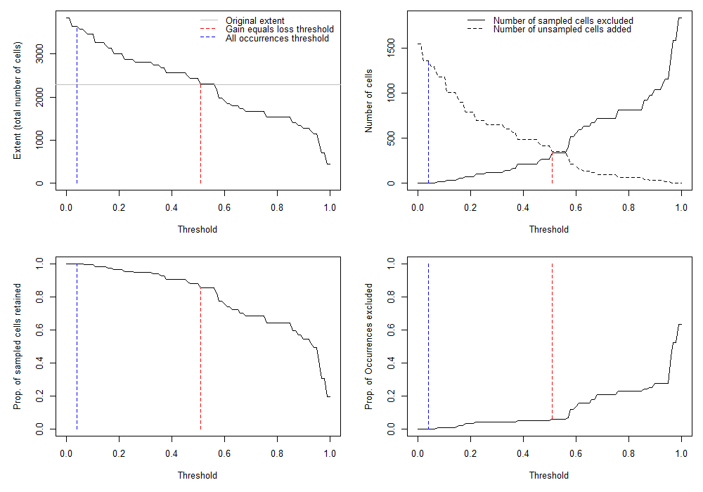

```{r, include = FALSE}
knitr::opts_chunk$set(
  collapse = TRUE,
  comment = "#>"
)
```

```{r setup}
library(downscale)
```

In order to `downscale` occupancy we first need to `upgrain` our atlas data across several scales (grain sizes). The occupancies at these scales are then used to fit our `downscale` models, which can then be extrapolated to predict occupancy at finer grain sizes using `predict.downscale`. However, if the boundaries of the atlas data are not regular, as we aggregate cells during upgraining then the extent also increases (Fig. \@ref(fig:OriginalUpgrain)). As the downscaling functions model the change in proportion of occupancy (the total extent divided by the area of occupancy) this is undesirable. This document provides a guide to the function `upgrain.threshold` which aims to advise users on the best way to upgrain atlas data.

```{r OriginalUpgrain, echo = FALSE, out.width = "100%", fig.align = "left", fig.cap = "Upgrained presence (red cells) and absence (white cells) maps for a UK species without standardising extent to the largest grain size. Unsampled cells are dark grey. As we upgrain the atlas data to larger grain sizes the total extent also increases."}
knitr::include_graphics("figures/Original_upgrain.png")
```

### How to standardise extent across scales

Instead we must ensure the extent is kept constant across all scales by fixing the extent at all grain sizes to the extent of the largest grain size (Fig. \@ref(fig:AllInterior)). For example, for the species above we could extend the atlas data by assigning unsampled cells that fall within the extent of the largest grain as absences. *It is then critically important that after downscaling we convert our proportion of occupied cells back to area of occupancy by using the standardised extent, not the original atlas data extent*.

```{r AllInterior, echo = FALSE, out.width = "100%", fig.align = "left", fig.cap = "Upgrained presence (red cells) and absence (white cells) maps for a UK species after standardising extent to the largest grain size. Unsampled cells are dark grey. The extent of the atlas data is extended to that of the largest grain size by assigning absences to unsampled cells."}

```

However, as we can see in we in figure \@ref(fig:AllInterior), at the atlas scale we have assumed that large areas of unsampled cells are absences (white cells). In the case of the UK the non-surveyed areas are largely sea and so are probably indeed absences, but in land-locked regions these areas could be suitable habitat for the species.

Instead we may choose to only keep those cells at the largest grain size that fall completely within the surveyed atlas data (Fig. \@ref(fig:InteriorOnly)). Therefore no assumptions are made that unsampled cells outside the original atlas data are absences.

```{r InteriorOnly, echo = FALSE, out.width = "100%", fig.align = "left", fig.cap = "Upgrained presence (red cells) and absence (white cells) maps for a UK species after standardising extent to those cells at the largest grain size that solely contain sampled atlas data. Sampled cells outside the selected cells are assigned as No Data (dark grey)."}

```

Although we no longer make assumptions about unsampled areas, if the shape of the atlas boundary is irregular, or if there are unsampled cells within the atlas data, such as here, then this method may exclude a large proportion of the original atlas data, even known presences. This may be particularly pronounced for species that occupy the edges of the extent, such as coastal species, as very few of these edge cells will be retained using such a procedure.

Therefore there is a clear trade-off between assigning large areas of unsampled areas as absence, and discarding sampled areas and known presences. Instead it may be sensible to apply some threshold where those cells at the largest grain size that only contain a certain amount of unsampled area are discarded. The `upgrain.threshold` function allows visualisations of this trade-off at the atlas scale through four plots against threshold (Fig. \@ref(fig:ThresholdPlots)):

a) The total standardised extent.
b) The number of unsampled cells added and assigned as absences, and the number of sampled cells excluded and assigned as No Data.
c) The proportion of the original atlas data retained.
d) The proportion of known presences excluded.

```{r fig.show = "hide"}
# The data may be a raster layer of presence (1) and absence (0) data or a
# data frame of cell centre coordinates and presence-absence data in which case
# it must have these column names: "x", "y", "presence"
data.file <- system.file("extdata", "atlas_data.txt", package = "downscale")
atlas.data <- read.table(data.file, header = TRUE)

# run upgrain.threshold for three larger grain sizes
thresh <- upgrain.threshold(atlas.data = atlas.data,
                            cell.width = 10,
                            scales     = 3,
                            thresholds = seq(0, 1, 0.01))
```

```{r ThresholdPlots, echo = FALSE, out.width = "100%", fig.align = "left", fig.cap = 'Diagnostic plots produced by `upgrain.threshold` used to explore the trade-off  between assigning large areas of unsampled areas as absence, and discarding sampled areas and known presences. Two possible thresholds in the quantity of unsampled area allowed within cells at the largest grain size are identified: the "All_Occurrences" threshold (blue line) and the "Gain_Equals_Loss" threshold (red line).'}

```

The user can, of course, use any threshold as the input for the `upgrain` function, however we have also identified four possibilities for the user (Groom et. al. 2018, Marsh et. al. 2018), the two criteria applied above, as well as a species-specific and an atlas-specific option:

|Threshold|Name|Description|
|:--------|:---|:----------|
|0|`"All_Sampled"`|All of the original atlas data is included (Fig. \@ref(fig:AllInterior)).|
|Blue line (species-specific)|`"All_Occurrences"`|The threshold where no occurrences in the atlas data are excluded (Fig. \@ref(fig:ThresholdPlots)d).|
|Red line (atlas-specific)|`"Gain_Equals_Loss"`|The threshold where the number of sampled atlas cells reclassified as No Data equals the number of unsampled exterior cells reclassified as absence (Fig. \@ref(fig:ThresholdPlots)b). In this threshold the new standardised extent also equals the extent of the original atlas data (Fig. \@ref(fig:ThresholdPlots)a).|
|1|`"Sampled_Only"`|Only cells that contain 100% sampled atlas data are included (Fig. \@ref(fig:InteriorOnly)).|

The thresholds for each of the four criteria is saved in the results object.
```{r}
thresh$Thresholds
```

Or we can take a look at the table of values used to create the four diagnostic plots.
```{r}
head(thresh$Data)
```

Figure \@ref(fig:ThresholdMaps) shows the maps if each of these thresholds were applied. The semi-transparent area within the black polygon are the cells included after applying the threshold. This is overlain on the original atlas data where red = presence, light grey = absence, and dark grey = unsampled cells. The plots allow a visual interpretation of where and how much sampled data is removed and unsampled data added. For example, due to the distribution of our unsampled cells throughout our atlas data, the `"Sampled_Only"` threshold only captures the very central portion of our species distribution. The `"Gain_Equals_Loss"` threshold excludes some occurrences at the edges of the species distribution, whereas the `"All_Occurrences"` threshold includes a large amount of unsampled areas.

```{r ThresholdMaps, echo = FALSE, out.width = "100%", fig.align = "left", fig.cap = "Maps of the atlas data (red = presence; light grey = absence; unsampled = dark grey) overlain with polygons showing the standardised extent after applying each of four possible thresholds."}
knitr::include_graphics("figures/Threshold_maps.png")
```

### The effect of the number of scales

A further consideration is the number of scales to upgrain. A larger number of scales means there is more data to fit the downscaling models, however the larger discrepancy there will be between the original extent of the atlas data and the new standardised extent. We can see that exemplified in the following examples. First we will upgrain only a further two scales.
```{r eval = FALSE}
# run upgrain.threshold for two larger grain sizes
thresh <- upgrain.threshold(atlas.data = atlas.data,
                            cell.width = 10,
                            scales     = 2,
                            thresholds = seq(0, 1, 0.01))
```

```{r ThresholdMaps2, echo = FALSE, out.width = "100%", fig.align = "left", fig.cap = "Maps for the four possible thresholds after upgraining across two scales."}

```

Here we have upgrained another two grain sizes, resulting in three estimates of proportion of occupancy. Compared to figure \@ref(fig:ThresholdMaps) the standardised data are much more similar to the original atlas data (fig. \@ref(fig:ThresholdMaps2)). However, three estimates of occupancy is the minimum necessary for fitting the downscale models and so may result in a poor model fit and therefore poor predictions of occupancy at finer grain sizes.

Alternatively, we may decide that we want five grain sizes with which to fit the model and therefore upgrain the atlas data a further four scales.
```{r eval = FALSE}
# run upgrain.threshold for four larger grain sizes
thresh <- upgrain.threshold(atlas.data = atlas.data,
                            cell.width = 10,
                            scales     = 4,
                            thresholds = seq(0, 1, 0.01))
```

```{r ThresholdMaps4, echo = FALSE, out.width = "100%", fig.align = "left", fig.cap = "Maps for the four possible thresholds after upgraining across four scales."}

```

Now we have more data for fitting the models, but the standardised data is some way different from the original atlas data (fig. \@ref(fig:ThresholdMaps4)) and there is no way to assign a `"Sampled_Only"` threshold. It is also important to remember that once the scale of saturation or endemism is reached for a given species, there is no further value from larger grain sizes as these are discarded for modelling purposes. The scale of saturation is the grain size at which all cells are occupied, and the scale of endemism is the grain size where only a single cell is occupied. Use the `upgrain` function to check for scales of endemism or saturation for your chosen scale and threshold.

### Conclusion

The choice of threshold and number of scales to upgrain is therefore dependent upon the shape of the atlas region and the distribution of the species under study. For example, if the atlas region is rectangular then the `"Sampled_Only"` threshold may result in no loss of sampled cells and in fact all four threshold options may be the same. Or if a species is confined to the interior of the region then the `"All_Occurrences"` threshold may equal the `"Sampled_Only"` threshold. Alternatively, for a species confined to the edges of the atlas region then the `"All_Occurrences"` threshold may equal the `"All_Sampled"` threshold.

We therefore provide no single recommendation, but instead the final choice of threshold and number of scales should be determined on a case-by-case basis. For this we recommend that it is often worth exploring several scales and threshold criteria, following each through `upgrain.threshold`, `upgrain`, `downscale` and `predict.downscale` in order to visually assess the process at each stage, and ultimately which upgraining procedure is likely providing the best model fits and predictions.

### References

Groom, Q., Marsh, C.J., Gavish, Y. and W. E. Kunin. 2018. How to predict fine resolution occupancy from coarse occupancy data. Methods in Ecology and Evolution. In press.

Marsh, C.J, Barwell, L.J., Gavish, Y. and W. E. Kunin. 2018. downscale: An R package for downscaling species occupancy from coarse-grain data to predict occupancy at fine-grain sizes. Journal of Statistical Software, Code Snippets 86(3):1-20.

